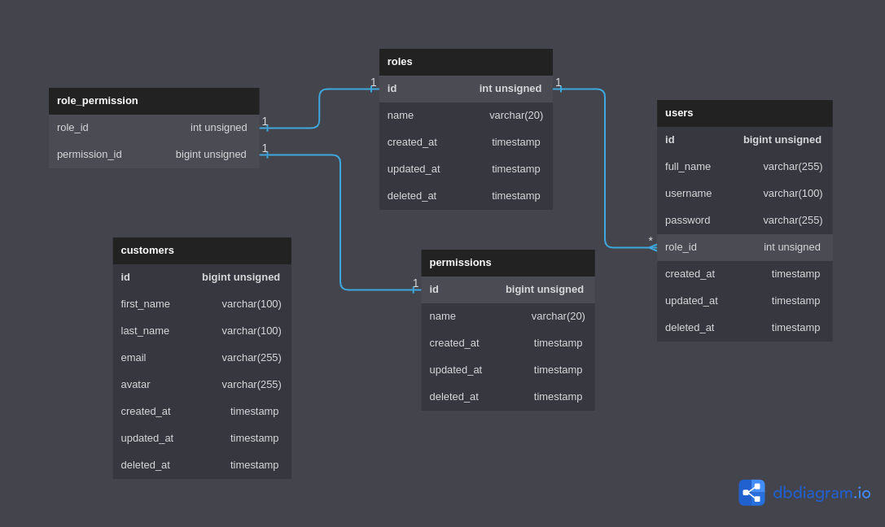

# Auth with Clean Architecture
This mini project describes about authentication, but I will implement clean architecture as well. Here are the guidelines you to follow:
* [Setup](#scenario)
* [How to Run](#how-to-run)
* [Postman Collection](#postman-collection)
* [Docker Registry](#docker-registry)
* [Tech Spec](#tech-spec)

## Setup
1. Install `Go` and `MySQL`.
    * [`Go`](https://go.dev/doc/install)
    * [`MySQL`](https://dev.mysql.com/doc/)
1. Cloning this project out with the following command:
    * Using SSH URL
    ```bash
    $ git clone git@github.com:azisalvriyanto/auth-with-clean-architecture.git
    ```
    * Using HTTPS URL
    ```bash
    $ git clone https://github.com/azisalvriyanto/auth-with-clean-architecture.git
    ```
1. Do the command to install the dependencies:
    ```bash
    $ go mod download
    ```
1. Set up the database configuration at `.env`, you can copy default file in .env.example. For example:
    ```text
    DB_HOST=127.0.0.1
    DB_PORT=3306
    DB_USERNAME=root
    DB_PASSWORD=
    DB_DATABASE=auth_with_clean_architecture
    ```
1. Set up the jwt key at `.env`, For example:
    ```text
    JWT_KEY="awesome-secret-key"
    ```

1. Do the command to import database configuration:
    ```bash
    $ mysql -u root -p < ./docs/auth_with_clean_architecture_backup.sql
    ```

## How to Run
Use this command to run API app from root directory:
```bash
go run cmd/main.go
```

## Postman Collection
You can get postman collection [here](https://api.postman.com/collections/6937269-6ca38275-4202-4fb7-ae6f-7ca2dcea5cd7?access_key=PMAT-01H29HTHD0475RNAZDQXSP6ZDK).

## Docker Registry
Do the command to pull docker registry:
```bash
docker pull azisalvriyanto/auth-and-clean-architecture:1.0
```

## Tech Spec
### Feature Description
there are three endpoint that could use for appointment process, which are:
1. Login and show profile
1. Create, read, update and delete User
1. Create, read, update and delete Customer

### Architecture and Design
This service using onion architecture, there are 5 layers from inner to outer which are entity, repository, use case, controller, and request handler. the usage and responsibility of each layer are follow:
1. Entity: this layer contains the domain model or entities of the system. These are the core objects that represent the business concepts and rules.
1. Repository: This layer provides an interface for the application to access and manipulate the entities. It encapsulates the data access logic and provides a way to abstract the database implementation details.
1. Use case : This layer contains the business logic or use cases of the system. It defines the operations that can be performed on the entities and orchestrates the interactions between the entities and the repository layer.
1. Controller: This layer handles the HTTP requests and responses. It maps the incoming requests to the appropriate use case and returns the response to the client.
1. Request handler: This layer is responsible for handling the incoming HTTP requests and passing them on to the controller layer.

### Data Flow Diagram
There are 5 table that dedicated on this services which are users, customers, roles, permissions and role_permission. For complete explanation of database structure you can follow this ddf.


